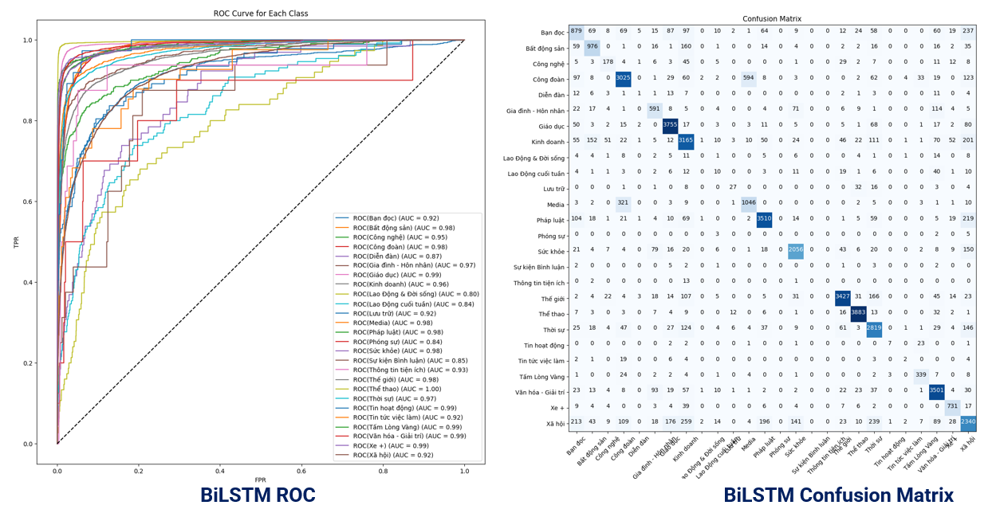

[English](README.md) | [简体中文](github/cn_Zh_ReadmeMD.md) | [Tiếng việt](github/vi_vn_ReadmeMD.md)
# Update: 1/2/2024. This project is in the completion stage. I am writing Readme.md file. I'm sorry because it is slowly.

## Contents
1. [Vietnamese Category Classification](#introduction)
2. [Results](#results)
3. [Evaluation](#evaluation)
4. [Installation](#installation)
5. [Quick Start Overview](#quick-start-overview)
6. [Structures](#structures)
7. [Send Us Feedback!](#send-us-feedback)
8. [Thanks](#thanks)
9. [License](#license)


# Introduction

This project provides category classification for Vietnamese Newspaper. I used 3 model to train model such as BiGRU( Bidirectional GRU), BiLSTM(Bidirectional LSTM) and LSTM.

# Results
### Summary Category Vietnamese Newspaper Classification
<p align="center">
    
    <br>
    <sup>Testing with Tuoi Tre newspaper <a href="https://github.com/CMU-Perceptual-Computing-Lab/openpose" target="_blank"><i> on Streamlit </i></a>
</p>

# Evaluation
For this part, we use [LSTM]([https://github.com/ultralytics/yolov3](https://vi.wikipedia.org/wiki/B%E1%BB%99_nh%E1%BB%9B_d%C3%A0i-ng%E1%BA%AFn_h%E1%BA%A1n)),[BiLSTM](https://www.geeksforgeeks.org/bidirectional-lstm-in-nlp/) and [BiGRU](https://www.gabormelli.com/RKB/Bidirectional_GRU_Network). To evaluation this model we use 50k set, which is split from the original [Dataset](https://www.kaggle.com/datasets/phamtheds/news-dataset-vietnameses) dataset. Result shown in Table 1 and Table 2. 

**Table 1. Comparison result of LSTM, BiLSTM and LSTM (Concat with summary)**
|    Model   	|             Class      Mesure 	| **0** 	| **1** 	| **2** 	| **3** 	| **4** 	| **5** 	| **6** 	| **7** 	| **8** 	| **9** 	| **10** 	| **11** 	| **12** 	| **13** 	| **14** 	| **15** 	| **16** 	| **17** 	| **18** 	| **19** 	| **20** 	| **21** 	| **22** 	| **23** 	| **24** 	| **25** 	|
|:----------:	|:-----------------------------:	|:-----:	|:-----:	|:-----:	|:-----:	|:-----:	|:-----:	|:-----:	|:-----:	|:-----:	|:-----:	|:------:	|:------:	|:------:	|:------:	|:------:	|:------:	|:------:	|:------:	|:------:	|:------:	|:------:	|:------:	|:------:	|:------:	|:------:	|:------:	|
|  **BiGRU** 	|         **Precision**         	|  0.63 	|  0.73 	|  0.81 	|  0.79 	|   0   	|  0.73 	|  0.86 	|  0.76 	|   0   	|  0.33 	|  0.77  	|  0.76  	|  0.93  	|    0   	|  0.84  	|    0   	|  0.72  	|  0.93  	|  0.96  	|  0.82  	|    1   	|    1   	|  0.86  	|  0.86  	|  0.88  	|  0.67  	|
|            	|           **Recall**          	|  0.51 	|  0.8  	|  0.49 	|  0.87 	|   0   	|  0.69 	|  0.96 	|  0.81 	|   0   	|  0.02 	|  0.11  	|  0.64  	|  0.85  	|    0   	|  0.87  	|    0   	|  0.81  	|  0.91  	|  0.98  	|  0.83  	|  0.05  	|  0.05  	|  0.79  	|  0.94  	|  0.87  	|  0.64  	|
|            	|          **F1-Score**         	|  0.56 	|  0.77 	|  0.61 	|  0.83 	|   0   	|  0.71 	|  0.91 	|  0.79 	|   0   	|  0.04 	|  0.19  	|  0.69  	|  0.89  	|    0   	|  0.86  	|    0   	|  0.76  	|  0.92  	|  0.97  	|  0.83  	|   0.1  	|  0.09  	|  0.82  	|   0.9  	|  0.87  	|  0.65  	|
|            	|          **Accuracy**         	|  0.83 	|       	|       	|       	|       	|       	|       	|       	|       	|       	|        	|        	|        	|        	|        	|        	|        	|        	|        	|        	|        	|        	|        	|        	|        	|        	|
| **BiLSTM** 	|         **Precision**         	|  0.54 	|  0.79 	|  0.54 	|  0.81 	|   0   	|  0.68 	|  0.91 	|  0.78 	|   0   	|  0.21 	|  0.47  	|  0.72  	|  0.89  	|    0   	|  0.82  	|    0   	|    1   	|  0.91  	|  0.97  	|  0.78  	|  0.57  	|  0.44  	|  0.81  	|  0.87  	|  0.82  	|  0.63  	|
|            	|           **Recall**          	|  0.53 	|  0.73 	|  0.55 	|  0.82 	|   0   	|  0.69 	|  0.93 	|  0.77 	|   0   	|  0.08 	|  0.37  	|  0.69  	|  0.87  	|    0   	|  0.86  	|    0   	|  0.69  	|   0.9  	|  0.97  	|  0.83  	|  0.35  	|  0.17  	|  0.85  	|  0.89  	|  0.87  	|  0.63  	|
|            	|          **F1-Score**         	|  0.54 	|  0.76 	|  0.55 	|  0.82 	|   0   	|  0.69 	|  0.92 	|  0.77 	|   0   	|  0.12 	|  0.41  	|  0.71  	|  0.88  	|    0   	|  0.84  	|    0   	|  0.81  	|  0.91  	|  0.97  	|  0.81  	|  0.43  	|  0.25  	|  0.83  	|  0.88  	|  0.84  	|  0.63  	|
|            	|          **Accuracy**         	|  0.82 	|       	|       	|       	|       	|       	|       	|       	|       	|       	|        	|        	|        	|        	|        	|        	|        	|        	|        	|        	|        	|        	|        	|        	|        	|        	|
|  **LSTM**  	|         **Precision**         	|  0.48 	|  0.46 	|   0   	|  0.64 	|   0   	|  0.56 	|  0.8  	|  0.57 	|   0   	|   0   	|    0   	|    0   	|  0.82  	|    0   	|  0.73  	|    0   	|    0   	|  0.88  	|  0.95  	|  0.73  	|    0   	|    0   	|  0.71  	|  0.82  	|    0   	|  0.38  	|
|            	|           **Recall**          	|  0.04 	|  0.39 	|   0   	|  0.9  	|   0   	|  0.3  	|  0.93 	|  0.7  	|   0   	|   0   	|    0   	|    0   	|  0.87  	|    0   	|   0.8  	|    0   	|    0   	|  0.83  	|  0.94  	|  0.75  	|    0   	|    0   	|  0.29  	|  0.84  	|    0   	|  0.57  	|
|            	|            F1-Score           	|  0.07 	|  0.42 	|   0   	|  0.75 	|   0   	|  0.39 	|  0.86 	|  0.63 	|   0   	|   0   	|    0   	|    0   	|  0.84  	|    0   	|  0.76  	|    0   	|    0   	|  0.85  	|  0.95  	|  0.74  	|    0   	|    0   	|  0.41  	|  0.83  	|    0   	|  0.46  	|
|            	|            Accuracy           	|  0.8  	|       	|       	|       	|       	|       	|       	|       	|       	|       	|        	|        	|        	|        	|        	|        	|        	|        	|        	|        	|        	|        	|        	|        	|        	|        	|

**Table 2. Comparison result of LSTM, BiLSTM and LSTM (Concat with summary and title)**
|  **Model** 	| **            Class      Mesure** 	| **0** 	| **1** 	| **2** 	| **3** 	| **4** 	| **5** 	| **6** 	| **7** 	| **8** 	| **9** 	| **10** 	| **11** 	| **12** 	| **13** 	| **14** 	| **15** 	| **16** 	| **17** 	| **18** 	| **19** 	| **20** 	| **21** 	| **22** 	| **23** 	| **24** 	| **25** 	|
|:----------:	|:---------------------------------:	|:-----:	|:-----:	|:-----:	|:-----:	|:-----:	|:-----:	|:-----:	|:-----:	|:-----:	|:-----:	|:------:	|:------:	|:------:	|:------:	|:------:	|:------:	|:------:	|:------:	|:------:	|:------:	|:------:	|:------:	|:------:	|:------:	|:------:	|:------:	|
|  **BiGRU** 	|           **Precision**           	| 0.52  	| 0.8   	| 0.75  	| 0.81  	| 0.14  	| 0.67  	| 0.89  	| 0.77  	| 0.12  	| 0.23  	| 0.62   	| 0.73   	| 0.9    	| 0      	| 0.85   	| 0      	| 1      	| 0.91   	| 0.97   	| 0.79   	| 0.4    	| 0.38   	| 0.83   	| 0.9    	| 0.91   	| 0.61   	|
|            	|             **Recall**            	| 0.56  	| 0.7   	| 0.53  	| 0.82  	| 0.05  	| 0.7   	| 0.94  	| 0.79  	| 0.05  	| 0.19  	| 0.41   	| 0.66   	| 0.87   	| 0      	| 0.84   	| 0      	| 0.19   	| 0.91   	| 0.95   	| 0.84   	| 0.27   	| 0.24   	| 0.8    	| 0.87   	| 0.84   	| 0.66   	|
|            	|            **F1-Score**           	| 0.54  	| 0.75  	| 0.62  	| 0.81  	| 0.07  	| 0.68  	| 0.91  	| 0.78  	| 0.07  	| 0.21  	| 0.5    	| 0.69   	| 0.88   	| 0      	| 0.84   	| 0      	| 0.32   	| 0.91   	| 0.96   	| 0.82   	| 0.32   	| 0.3    	| 0.81   	| 0.88   	| 0.87   	| 0.63   	|
|            	|            **Accuracy**           	|  0.84 	|       	|       	|       	|       	|       	|       	|       	|       	|       	|        	|        	|        	|        	|        	|        	|        	|        	|        	|        	|        	|        	|        	|        	|        	|        	|
| **BiLSTM** 	|           **Precision**           	| 0.52  	| 0.69  	| 0.67  	| 0.79  	| 0.5   	| 0.69  	| 0.89  	| 0.81  	| 0     	| 0.11  	| 0.51   	| 0.74   	| 0.87   	| 0      	| 0.83   	| 0      	| 0.7    	| 0.9    	| 0.97   	| 0.77   	| 0.14   	| 0.31   	| 0.81   	| 0.89   	| 0.88   	| 0.65   	|
|            	|             **Recall**            	| 0.53  	| 0.79  	| 0.6   	| 0.84  	| 0.03  	| 0.65  	| 0.94  	| 0.75  	| 0     	| 0.08  	| 0.42   	| 0.62   	| 0.9    	| 0      	| 0.86   	| 0      	| 0.44   	| 0.91   	| 0.96   	| 0.83   	| 0.08   	| 0.1    	| 0.79   	| 0.9    	| 0.84   	| 0.61   	|
|            	|            **F1-Score**           	| 0.53  	| 0.73  	| 0.63  	| 0.81  	| 0.06  	| 0.67  	| 0.91  	| 0.78  	| 0     	| 0.09  	| 0.46   	| 0.68   	| 0.89   	| 0      	| 0.84   	| 0      	| 0.54   	| 0.9    	| 0.97   	| 0.8    	| 0.1    	| 0.15   	| 0.8    	| 0.89   	| 0.86   	| 0.63   	|
|            	|            **Accuracy**           	|  0.83 	|       	|       	|       	|       	|       	|       	|       	|       	|       	|        	|        	|        	|        	|        	|        	|        	|        	|        	|        	|        	|        	|        	|        	|        	|        	|
|  **LSTM**  	|           **Precision**           	|   -   	|   -   	|   -   	|   -   	|   -   	|   -   	|   -   	|   -   	|   -   	|   -   	|    -   	|    -   	|    -   	|    -   	|    -   	|    -   	|    -   	|    -   	|    -   	|    -   	|    -   	|    -   	|    -   	|    -   	|    -   	|    -   	|
|            	|             **Recall**            	|   -   	|   -   	|   -   	|   -   	|   -   	|   -   	|   -   	|   -   	|   -   	|   -   	|    -   	|    -   	|    -   	|    -   	|    -   	|    -   	|    -   	|    -   	|    -   	|    -   	|    -   	|    -   	|    -   	|    -   	|    -   	|    -   	|
|            	|              F1-Score             	|   -   	|   -   	|   -   	|   -   	|   -   	|   -   	|   -   	|   -   	|   -   	|   -   	|    -   	|    -   	|    -   	|    -   	|    -   	|    -   	|    -   	|    -   	|    -   	|    -   	|    -   	|    -   	|    -   	|    -   	|    -   	|    -   	|
|            	|              Accuracy             	|   -   	|       	|       	|       	|       	|       	|       	|       	|       	|       	|        	|        	|        	|        	|        	|        	|        	|        	|        	|        	|        	|        	|        	|        	|        	|        	|

In addition, we also use [ROC](https://en.wikipedia.org/wiki/Receiver_operating_characteristic) to evaluate model. The result for Bidirectional GRU and Bidirection LSTM with no concat shown in figure 1 and figure 2. Concat with summary of BiGRU and BiLSTM shown in figure 3 and 4.

**Fig 1. Receiver Opeating Characteristic and Confusion Matrix for BiGRU Model**
<p align="center">
    
    <br>
</p>

**Fig 2. ROC and Confustion Matrix for BiLSTM Model**
<p align="center">
    
    <br>
</p>

**Fig 3. ROC and LogLoss for BiLSTM Model [Concatenate with summary]**
<p align="center">
    
    <br>
</p>
# Installation

### With Python Base
Requirements python >= 3.7 
1. Install dependences library
 ```bash
 pip install -r requirements.txt
```
2. Install dependences files
- Change directory to ``` OpenPose/graph_models/VGG_origin```, you can change directory with this command ```cd OpenPose/graph_models/VGG_origin ```
- After you must run ``` file_requirements.py ``` or
 ``` bash
python file_requirements.py
```
3. Install dependences files with other steps ( Optional )
- If you step 2 not successfully you can download weights from [Google Drive](https://drive.google.com/drive/folders/1Y4coXLsVzCXYuCKpyDfQBqpHH8Aj-Yg5?usp=sharing)
- Move folder ```graph_models``` downloaded to ```OpenPose\graph_models``` 

### With Anaconda 
1. Install dependences library
   - You can load dependences library with ``` openpose.yaml``` file.
   - You can find ```openpose.yaml``` file in folder ```Environment```
2. Install dependences files
- Change directory to ``` OpenPose/graph_models/VGG_origin```, you can change directory with this command ```cd OpenPose/graph_models/VGG_origin ```
- After you must run ``` file_requirements.py ``` or
 ``` bash
python file_requirements.py
```
3. Install dependences files with other steps ( Optional )
- If you step 2 not successfully you can download weights from [Google Drive](https://drive.google.com/drive/folders/1Y4coXLsVzCXYuCKpyDfQBqpHH8Aj-Yg5?usp=sharing)
- Move folder ```graph_models``` downloaded to ```OpenPose\graph_models``


# Quick Start Overview
### With Python Base Environments and Anaconda Environment
1. Quick Run
 - You can run this file ```main.py``` to start this project. 
2. [Optinal]To trainning model you using ```create_data.py``` to export data points and move to folder ```Action\trainning``` and using .ipnb file ```train.ipnb``` to train.
3. [Optinal] Using VGG_origin can be slow, if you don't have GPU you can change model to ```mobilenet``` to predict faster.
   - To change model to ```mobilenet```, navigation to file ```main.py``` in main folder.
   - In line 14, change ``` estimator = load_pretrain_model('VGG_origin')``` to ```estimator = 
 load_pretrain_model('mobilenet_thin')```
   
4.[Optinal] To use your weight, you can change it in ```main.py```, in line 15 change ```action_classifier = load_action_premodel('open_pose2\Action\framewise_recognition_under_scene.h5')``` to ```action_classifier = load_action_premodel('path_to_your_weights')```
  
# Structures
**Structures for all models**
<p align="center">
    
    <br>
</p>

# Send Us FeedBack
Our project is open source for research purposes, and we want to improve it! So let us know (create a new GitHub issue or pull request, email us, etc.) if you...
1. Find/fix any bug (in functionality or speed) or know how to speed up or improve any part of OpenPoseRNN.
2. Want to add/show some cool functionality/demo/project made on top of Students Tracking. We can add your project link to your [Issue](https://github.com/datnguyen-tien204/Tracking_Students/issues)

# Thanks
Thank you for the guidance of Dr.Minh Chuan-Pham in the process of creating this project, as well as the evaluation board consisting of Dr.Quoc Viet-Hoang, who helped us improve the results and provided feedback for this project.

# License
This project is freely available for free non-commercial use. If it useful you can give 1 star. Thanks for using.
